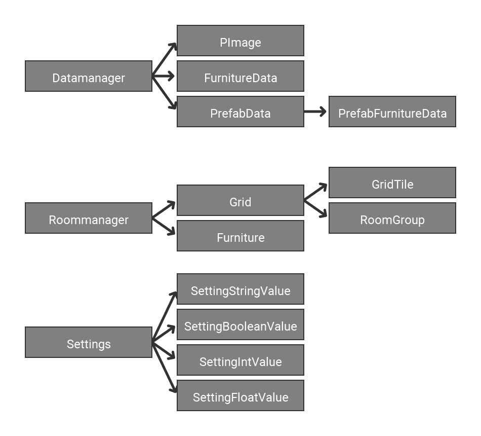

PAccem
======

Introduction
----------

### Tab Bar

| Number | Action                                                         |
|--------|----------------------------------------------------------------|
| 1      | Opens a Popup to create a new Room with the chosen size        |
| 2      | Switches between 2D and 3D view mode                           |
| 3      | Opens the room list with all rooms from data/rooms             |
| 4      | Opens the save menu to save the current room                   |
| 5      | Opens the room group list                                      |
| 6      | Opens the price menu, which shows the cost of the current room |
| 7      | Opens the Settings menu                                        |
| 8      | Opens the reset menu to reset the current room                 |
| 9      | Opens the about menu (version, author, githublink)             |

### Tool Bar

| Number | Tool, use                                                 |
|--------|-----------------------------------------------------------|
| 1      | Move Tool, to look around in the 2D view mode              |
| 2      | Draw Tool, to create to room layout                       |
| 3      | Furniture Tool, to place new Furnitures                   |
| 4      | Select Tool, to select furnitures and move or delete them |
| 6      | Fill Tool, to fill out an area in the room grid            |
| 7      | Window Tool, to place windows                             |

Inheritance 
---------

Composition
-----------

Class Overview
----------------

### PAccem.pde/PApplet

PApplet is a Class which contains a main(setup) and a loop(draw) function.
It represents the highest class for the programmer and defines the starting point.
All Mouse and Keyboard Events are handed over in this class.

Further information about PApplet and the Processingconstrukt: see attachment.

#### Variables

ApplicationManager am: manages the overall application (title, size, initialization)

Settings st: loads and stores the current settings

LanguageManager lg: loads the current language file (see: data/assets/lang/)

RoomManager rm: manages the room(grid, furniture & user input)

DataManager dm: stores data (3D-models, images, etc.)

OverlayManager ov: creates and manages the GUI

PGraphics pg: used for 3D-graphics

PShader blurshader: blur shader

PFont font: the current font

boolean usegl: opengl setting when the application has started

boolean allowcgol: ?

ArrayList toovmessages: messages which are send to the overlay

int[] c: easily accessible color values (0-8 => 0 - 255 or 255 - 0)

boolean isKeyUp, isKeyRight, isKeyLeft, isKeyDown, isKeyT: state of these keys

boolean deb: debug mode

boolean disableblur: whether or not blur is disabled

#### Functions

void settings(): is being executed once before the window is created	(pre-main())

void setup(): is being executed once after the window is being created 	(main())

void draw(): is being executed on every frame

void mouseWheel(MouseEvent e): is being executed when the user moves his mouse wheel

void mouseDragged(): is being executed when the user moves his mouse while a mouse button is down

void mouseReleased(): is being executed when the user releases a mouse button

void mousePressed(): is being executed when the user pressed a mouse button

void keyPressed(KeyEvent e): is being executed when the user presses a key

void keyReleased(): is being executed when the user releases a key

### ApplicationManager

ApplicationManager initializes (all) variables in PAccem.pde/PApplet and create a Window based on the program settings.
It also handles arguments, colors, fonts, the program title and the program window .

#### Variables

String setfontrawinput: is being used by Thread in setFontRaw()

#### Functions

void initSettings(): is being executed once before the window is created

void initSetup(): is being executed once after the window is being created

void setTitle(String name): sets the window title

void setFont(String newfontname): sets the current font

void setFontRaw(): uses the chosen font if available or fall back to the default font (Roboto Regular)

void recalculateColor(): recalculates the easily accessible color values according to the dark mode setting

void manageArgs(): handles all arguments which have been handed over to the program

| Name     | Action                    |
|----------|---------------------------|
| \-debug  | activates the debug mode  |
| \-noblur | deactivates blurring      |

void loop(): set window size according to the width & height setting

### DataManager

#### Variables

final PImage[] icons: 

final FurnitureData[] furnitures: 

final PrefabData[] prefabs: 

#### Functions

int[] validate(): checks if in every prefabs the used furnitures are in the given boundary box (can only be executed after class construction)

boolean validateId(int id): checks if a furniture with the given id exists

FurnitureData getFurnitureData(int id): return the furniture data with the corresponding id

PrefabData getPrefabData(int id): return the prefab data with the corresponding id

#### Extra

##### PImage

PImage contains an image.

##### PShape

PShape contains a 3D model.

##### FurnitureData

FurnitureData contains all information about a furniture.

##### PrefabFurnitureData

PrefabFurnitureData contains all information about a furniture in a prefab.

##### PrefabData

PrefabData contains all information about a prefab.

### Furniture
The Furniture class represents a single furniture, which is being contained in the RoomManager.

#### Variables

int id: id of the furniture

int price: price of the furniture

color tint: tintcolor of the furniture

#### Functions

void draw(boolean viewmode, boolean selected): draws the furniture

void drawFrame(boolean selected): draws boundary frame on the furniture

boolean checkover(): checks if the mouse is on the furniture

boolean checkover(int xpos, int ypos): checks if the furniture is on the position

boolean setXPos(int value): sets the X-Position to the given one

boolean setYPos(int value): sets the Y-Position to the given one

void move(int dx, int dy): moves the furniture in the given direction

### Grid

The Grid class manages the grid of the room and is being contained in the RoomManager.

#### Variables

GridTile[][] tiles: 2 dimensional array of tiles

ArrayList roomgroups: list of all room groups

#### Functions

void draw(boolean viewmode, float gts): draw the room grid

void fillTool(boolean value, int x, int y): apply the fill tool

boolean setTileState(boolean value, int x, int y): sets the state of the grid tile on given state

Kachels fest boolean getTileState(int x, int y): return the state of the grid tile on the chosen position

boolean setTile(GridTile value, int x, int y): sets the grid tile on the chosen position to the given grid tile

GridTile getTile(int x, int y): return the grid tile on the chosen position if possible

boolean isinGrid(int x, int y): return true if the chosen position is inside the room grid

boolean isRoomGroupinuse(int id): returns whether or not a room group is in use

void removeRoomGroup(int id): removes a room group and sets all references in the grid to the main room group

void cgol(): hmmmm?

int getActiveTiles(): returns the amount of active tiles

#### Extra

##### GridTile

Contains all information about a single Tile.

##### RoomGroup

Contains all information about a room group.

### LanguageManager

LanguageManager loads a language file (see: data/assets/lang/) and return its values.

#### Variables

JSONObject data: current language data

#### Functions

boolean setLang(String newlang): sets the current language if available

String get(String key): get a translation in the current language

### OverlayManager

Die OverlayManager Klasse ist für das gesamt GUI zuständig. Die Variables und die build() Funktion können beliebig verändert werden um jedes mögliche GUI zu erstellen. Sie ist eine Erweiterung der Overlay Klasse, welche Aufgaben wie Zeichnen/Rendern und Event Handling übernimmt.

#### Variables

final int xoff: Wird verwendet um das Gitter am Overlay auszurichten

final int yoff: Wird verwendet um das Gitter am Overlay auszurichten

boolean drawpopup: Sichtbarkeitsstatus des Popups

int tabid: wird von Tabbar verwendet (siehe: OTabbar.pde)

String newroomname: Der Name für einen neuen Raum

int newroomxsize, newroomysize: Die Größe für einen neuen Raum

Object tempdata: temporäre Variable mit verschiedenen Verwendungen (meisten zum transfer von Daten mit dem Popup)

ArrayList messages: Alle Nachrichten welche in der Nachrichten Box sind

int consoleoff: Offset der Nachrichten (scrollen)

boolean drawconsole: Sichtbarkeitsstatus der Nachrichten Box

final int messageboxheight: Höhe der Nachrichten Box

#### Functions

void build(): Erstellt das Overlay

void checkMessages(): Fügt alle Nachrichten in toovmessages (siehe: PAccem/PApplet) der Nachrichten Box hinzu

void printMessage(String text): Fügt eine Nachricht der Nachrichten Box hinzu

void drawPopup(int id): Öffnet ein Popup (unterschiedlich je nach id)

| ID | Popup                       |
|----|-----------------------------|
| 0  | Benötig Neustart            |
| 1  | Neuer Raum                  |
| 2  | Infos                       |
| 3  | Zurücksetzen                |
| 4  | Entferne Raumgruppe         |
| 5  | Neue Raumgruppe             |
| 6  | Wähle Farbe                 |
| 7  | Aktiviere CGOL              |
| 8  | Standartraum überschreiben? |

### Overlay

Das Overlay basiert auf einem Parent Child Konzept in dem Viele Element ein oder mehrere Elemente beinhalten.
Z.B eine ListView kann eine Serie an Container enthalten, welche wiederum Text oder Image enthalten.
Die Implementierung Idee basiert auf der von Google entwickelten SDK namens Flutter.

#### Variables

Object[] items: Liste aller Elemente im Overlay

boolean visible: Sichtbarkeitsstatus des Overlays

#### Functions

void setitems(Object[] items): Nimmt alle OverlayElemente an sich und
positioniert sie am Nullpunk.

void draw(): Zeichnet/Rendert das Overlay

boolean ishit(): Ermittelt ob die Maus auf dem Overlay liegt

void mouseWheel(MouseEvent e): Wird ausgeführt, wenn der Nutzer sein Mausrad
dreht

boolean mousePressed(): Wird ausgeführt, wenn der Nutzer eine Maustaste drückt und gibt zurück, ob der Click etwas im Overlay ausgelöst hat

void mouseReleased(): Wird ausgeführt, wenn der Nutzer eine Maustaste loslässt

boolean mouseDragged(): Wird ausgeführt, wenn der Nutzer seine Maus bewegt und gibt zurück, ob die Bewegung etwas im Overlay ausgelöst hat

void keyPressed(KeyEvent e): Wird ausgeführt, wenn der Nutzer eine Tastaturtaste drückt

void keyReleased(): Wird ausgeführt, wenn der Nutzer eine Tastaturtaste loslässt

#### Extra

### RoomManager

Die RoomManager Klasse ist die wichtigste Klasse im Programm, welcher die eigentlichen Raumplaner Functions implementiert.

#### Variables

ArrayList furnitures: Liste aller Möbel im Raum

Grid roomgrid: Das aktuelle Raumgitter

int selectionid: der Index des aktuell ausgewählten Möbelstücks (-1 = kein)

String name: Name des Raums

float xoff, yoff, scale: Variables für die 2D Ansicht

float dxoff, dyoff, dzoff, angle1, angle2, dspeed: Variables für die 3D Ansicht

int gridtilesize: Größe eines Kachels

int tool: id des aktuell gewählten Werkzeuges

| ID | Werkzeug                         |
|----|----------------------------------|
| 0  | Bewegen                          |
| 1  | Zeichnen                         |
| 2  | Möbel oder Fertigteil platzieren |
| 3  | Möbelstück auswählen             |
| 4  | Füll Werkzeug                    |
| 5  | Fenster Platzieren               |

boolean viewmode: Wahr = 3D Ansicht, Falsch = 2D Ansicht

ArrayList dragtiles: Liste aller Kachel über welche der Nutzer bereits gezeichnet hat.

boolean dragstate: Zeichenstatus

int newfurnitureid = 0: id von neu Platzierten Möbelstücken

int newroomgroup: id der aktuell ausgewählten Raumgruppe zum zeichnen

boolean isprefab: ob gerade ein Fertigteil platziert wird

color furnituretint: Färbung von neu Platzierten Möbelstücken

#### Functions

void mouseWheel(MouseEvent e): Wird ausgeführt, wenn der Nutzer sein Mausrad dreht.

void mouseDragged(): Wird ausgeführt, wenn der Nutzer seine Maus bewegt.

void mouseReleased(): Wird ausgeführt, wenn der Nutzer eine Maustaste loslässt.

void mousePressed(): Wird ausgeführt, wenn der Nutzer eine Maustaste drückt.

void keyPressed(KeyEvent e): Wird ausgeführt, wenn der Nutzer eine Tastaturtaste drückt.

void keyReleased(): Wird ausgeführt, wenn der Nutzer eine Tastaturtaste loslässt.

float getXPos(): Verwandelt die Maus X Position in eine Raumgitter X Position.

float getYPos(): Verwandelt die Maus Y Position in eine Raumgitter Y Position.

boolean isFurniture(int xpos, int ypos): Gibt an, ob sich ein Möbelstück an der gegebenen Position gibt

int getXGridSize(): Gibt die X Größe/Breite des Raumgitter.

int getYGridSize(): Gibt die Y Größe/Höhe des Raumgitter.

String[] loadRooms(): Gibt eine Liste aller Räume im Ordner: data/rooms/

void save(String name): Speichert den aktuellen Raum in data/rooms/ mit dem gegebenen Namen.

void load(String name): Lädt den gegebenen Raum in data/rooms/.

int getPriceReport(): Gibt einen Preisbericht zurück, welche Informationen über die Raumkosten enthält.

void reset(): Setzt den Raummanager zurück

void newRoom(int xsize, int ysize): Erstellt einen neuen Raum mit der gegebenen Größe

void switchViewmode(): änder die Ansicht (2D -\> 3D, 3D -\> 2D)

void resetCamera(boolean viewmode): setzt die gegebene Kameraansicht zurück

void draw(): Zeichnet/Rendert den Raum

#### Extra

TODO

##### PriceReport

##### FurniturePriceReport

### Settings

Die Settings Klasse lädt alle Einstellungen aus data/settings.json, welcher er abspeichert, validiert und in ein leichter zugängliches Format verwandet. (siehe: Variables)

#### Variables

final SettingStringValue[] strings: Einstellung vom Typ String/Text

final SettingBooleanValue[] booleans: Einstellung vom Typ Boolean/Wahrheitswert

final SettingIntValue[] ints: Einstellung vom Typ Int/Ganze Zahl

final SettingFloatValue[] floats: Einstellung vom Typ Float/Kommazahl

#### Functions

int getSize(): Ermittelt die gesamte Anzahl an Einstellungen

String set(int id, String value): Setzt die gegebene Einstellung zum gegebenen
Wert. (automatische Datentyp Umwandlung)

SettingValue get(int id): Gibt die Einstellung mit der gegebenen id

void load(): Lädt die Einstellungen von data/settings.json wenn möglich

void save(): Speichert die Einstellung in data/settings.json

#### Extra

##### SettingStringValue

Ein Einstellungtyp, welcher einen String/Text abspeichert.

##### SettingBooleanValue

Ein Einstellungtyp, welcher einen Boolean/Wahrheitswert abspeichert.

##### SettingIntValue

Ein Einstellungtyp, welcher einen Boolean/Wahrheitswert abspeichert.
Der Wert kann durch einen Minimal- Maximalwert eingegrenzt werden.

##### SettingFloatValue

Ein Einstellungtyp, welcher einen Float/Kommazahl abspeichert.
Der Wert kann durch einen Minimal- Maximalwert eingegrenzt werden.

##### SettingValue

Eine als Rückgabewert verwendete Klasse um einen Wert von einem beliebigen
Datentyp auszugeben.

### Extra

#### Baseclasses

In baseclasses.pde werden Klassen zur Vererbung definiert und "temporäre" Klassen, welche in abstrakten Functions verwendet werden um Konstante Werte
weiter zu geben.

Point: 2D Punkt

PWH extends Point: Punkt, Breite und Höhe

RPoint extends Point: Rotation und Punkt

RPWH extends PWH: Rotation, Punkt, Breite und Höhe

class Temp: Speichert einen Integer/ganze Zahl

class STemp: Speichert einen String/Text

#### Basefunctions

In basefunctions.pde werden vielseitige Functions definiert.

String getAbout(): Gibt den Info Text

void setKey(int k, boolean bool): Legt den Status von manchen Tasten fest. (Pfeiltasten, T)

String cap(String str): Verwandelt den ersten Buchstaben eines Strings/Text in Großschrift

String fixLength(String str, int length, char c): Füllt einen String/Text mit einem gegebenen Zeichen bis der String/Text eine gegebene Länge erreicht hat.

void printColor(int c): Schreibt eine Farbe in die Konsole.

void printColorhex(int c):Schreibt eine Farbe in Hexadecimal in die Konsole.

#### Constants

In basefunctions.pde sind Konstanten definiert.

final String appname: Name des Programms

final String appversion: Version des Programms

final String appmaker: Name des Autors

final String githublink: Link zum GitHub Repository

Alle weiteren im Programm verwendeten Konstanten sind in PConstants definiert. (siehe Anhang)

### Overlay Elemente

Ein Overlay besteht aus einer vielzahl von Kinder/Elementen. Die anordnung ist dabei ähnlich wie bei einem Baumdiagramm.

#### Container

Enthält ein Kind/Element.

Wenn man mit der Maus auf den Container zeigt wird die Farbe verändert.

#### Dynamic

Erstellt anhand der abstrakten Funktion getitem() ein Kind/Element welches dann angezeigt wird.

#### EventDetector

Erkennt Maus und Keyboard Events vom Nutzer auf sein Kind/Element.

#### GridView

Ähnlich wie ListView, jedoch können mehrere Kinder pro Reihe angezeigt werden.

#### Image
Zeigt ein Bild an.

#### ListView

Eine einfache Liste aus Elementen/Kindern.

#### Popup

Zeigt ein Kind/Element im Bildschirmmittelpunkt an.

Der Hintergrund wird verdunkelt und weichgezeichnet.

Weichzeichner: siehe data/assets/shader/blur.glsl

#### Sizedbox

Wird in ListView verwendet um Leerstellen zu erstellen. Der Expand Parameter verursacht, dass die Sizedbox die maximale Größe in der ListView annimmt, dabei wird er sich den Platz mit anderen Sizedboxen fair teilen müssen. :(

#### Slider

Ein horizontaler Schieberegler.

#### Tabbar

Enthält eine ListView als Tabbar und zeigt je nach dem welcher Tab ausgewählt
ist das dazugehörige Kind/Element an.

#### Text

Zeigt einen unveränderbaren Text an.

#### SetValueText

Zeigt einen vom Nutzer veränderbaren Text an.

##### SetValueStyle

Definiert das Verhalten von SetValueText.

int type: Datentyp der Eingabe

| ID | Datentyp              |
|----|-----------------------|
| 0  | String/Text           |
| 1  | Boolean/Wahrheitswert |
| 2  | Integer/ganze Zahl    |
| 3  | Float/Kommazahl       |

int maxlength: die maximale Eingabenlänge

#### GetValueText

Zeigt einen unveränderbaren Text an, welcher durch eine abstrakte Funktion ermittelt wird.

#### Transform

Verschiebt sein Kind/Element und oder positioniert es in einer Bildschirmecke.

#### Visible

Versteckt sein Kind/Element anhand seiner abstrakten Funktion

#### Extra

OBase: Enthält Klassen, Enums, Interfaces und Functions welche vom gesamten Overlay verwendet werden.

Box: Wird im Overlay verwendet, um die Grenzen des Elements weiterzugeben.

TabData: Enthält Informationen, welche von Tabbar verwendet werden, um die Tabs zu erzeugen.

Builder: Erstellt einen Array aus Objects mithilfe einer abstrakten Funktion.

ListViewBuilder: Tut das gleiche, jedoch werden die Objects danach in eine ListView verwandelt.

Dir: Gibt eine Richtung an. (siehe ListView Code)

Align: Gibt eine Position an. (siehe Align Code)

Fit: Gibt das Verhalten von Image an. (siehe Image Code)

IOverlay: Enthält Functions, welche alle Overlay Elemente enthalten müssen.

dynamic casting: Da Java keine dynamische Variable besitzt, wird hier mithilfe des "instanceof" operators die Klasse ermittelt und der Befehl nach dem Casting für das Object ausgeführt.

Anhang
------

PAccem Github Repository: [Link](https://github.com/Techatrix/PAccem)

Processing Website: [Link](https://processing.org/)

Processing Github Repository: [Link](https://github.com/processing/processing)

PApplet Documentation: [Link](https://processing.github.io/processing-javadocs/core/processing/core/PApplet.html)

PConstants Documentation: [Link](https://processing.github.io/processing-javadocs/core/processing/core/PConstants.html)
