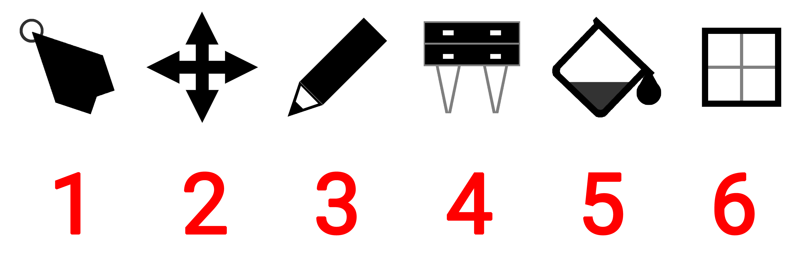
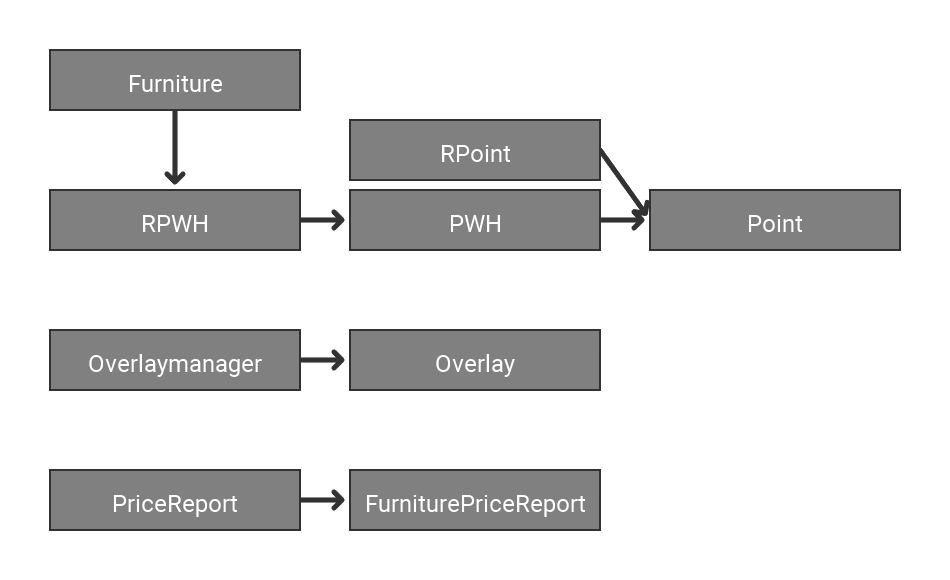

PAccem
======

Introduction
----------

### Tab Bar

| Number | Action                                                         |
|--------|----------------------------------------------------------------|
| 1      | Opens a Popup to create a new Room with the chosen size        |
| 2      | Switches between 2D and 3D view mode                           |
| 3      | Opens the room list with all rooms from data/rooms             |
| 4      | Opens the save menu to save the current room                   |
| 5      | Opens the room group list                                      |
| 6      | Opens the price menu, which shows the cost of the current room |
| 7      | Opens the Settings menu                                        |
| 8      | Opens the reset menu to reset the current room                 |
| 9      | Opens the about menu (version, author, githublink)             |

### Tool Bar

| Number | Tool, use                                                 |
|--------|-----------------------------------------------------------|
| 1      | Move Tool, to look around in the 2D view mode             |
| 2      | Draw Tool, to create to room layout                       |
| 3      | Furniture Tool, to place new Furnitures                   |
| 4      | Select Tool, to select furnitures and move or delete them |
| 5      | Fill Tool, to fill out an area in the room grid           |
| 6      | Window Tool, to place windows                             |

Inheritance 
---------

Composition
-----------

Settings
-----------

| Name                | Description                                                        |
|---------------------|--------------------------------------------------------------------|
| Default room name   | name of the room which is being loaded when the application starts |
| Language            | language of the program                                           |
| Font                | font name                                                          |
| Dark mode           | darkens the programs visuals                                                 |
| Hide Overlay        | hides the overlay                                                  |
| Fullscreen          | fullscreen mode                                                    |
| Use OpenGl Renderer | allows 3d view mode (requires OpenGL graphics card and x64)         |
| Width               | width of the application window                                    |
| Height              | height of the application window                                   |
| Anti-aliasing       | amount of anti aliasing (2 -> 2x anti-aliasing, etc.)              |
| Grid line weight    | thickness of the grid lines                                        |

Class Overview
----------------

### PAccem.pde/PApplet

PApplet is a Class which contains a main(setup) and a loop(draw) function.
It represents the highest class for the programmer and defines the starting point.
All Mouse and Keyboard Events are handed over in this class.

Further information about PApplet and the Processingconstrukt: see attachment.

#### Variables

ApplicationManager am: manages the overall application (title, size, initialization)

Settings st: loads and stores the current settings

LanguageManager lg: loads the current language file (see: data/assets/lang/)

RoomManager rm: manages the room(grid, furniture & user input)

DataManager dm: stores data (3D-models, images, etc.)

OverlayManager ov: creates and manages the GUI

Clipper cl: allows "pushing" and "popping" of clip() ( see: Processing push(), pop(), clip() )

PGraphics pg: used for 3D-graphics

PShader blurshader: blur shader

PFont font: the current font

boolean usegl: opengl setting when the application has started

boolean allowcgol: ?

ArrayList toovmessages: messages which are send to the overlay

int[] c: easily accessible color values (0-8 => 0 - 255 or 255 - 0)

boolean isKeyUp, isKeyRight, isKeyLeft, isKeyDown, isKeyT: state of these keys

boolean deb: debug mode

boolean disableblur: whether or not blur is disabled

#### Functions

void settings(): is being executed once before the window is created	(pre-main())

void setup(): is being executed once after the window is being created 	(main())

void draw(): is being executed on every frame

void mouseWheel(MouseEvent e): is being executed when the user moves his mouse wheel

void mouseDragged(): is being executed when the user moves his mouse while a mouse button is down

void mouseReleased(): is being executed when the user releases a mouse button

void mousePressed(): is being executed when the user pressed a mouse button

void keyPressed(KeyEvent e): is being executed when the user presses a key

void keyReleased(): is being executed when the user releases a key

### ApplicationManager

ApplicationManager initializes (all) variables in PAccem.pde/PApplet and create a Window based on the program settings.
It also handles arguments, colors, fonts, the program title and the program window .

#### Variables

String setfontrawinput: is being used by Thread in setFontRaw()

#### Functions

void initSettings(): is being executed once before the window is created

void initSetup(): is being executed once after the window is being created

void setTitle(String name): sets the window title

void setFont(String newfontname): sets the current font

void setFontRaw(): uses the chosen font if available or fall back to the default font (Roboto Regular)

void recalculateColor(): recalculates the easily accessible color values according to the dark mode setting

void manageArgs(): handles all arguments which have been handed over to the program

| Name     | Action                   |
|----------|--------------------------|
| \-debug  | activates the debug mode |
| \-noblur | deactivates blurring     |

void loop(): set window size according to the width & height setting

### Clipper

Clipper allows to "push" and "pop" the clip setting in the program. This relies on the clip() function of processing which limits the a area in which a draw function draws.

#### Variables

ArrayList<Clip> clips: contains the current and all previous clip settings to which can be "popped".

#### Functions

Clip get(): return the current clip setting

void pushClip(): "pushes" the current clip setting. This means that the current clip setting is being saved and then it set to the chosen one.

void popClip(): "poppes" the current clip setting. This means that it returns to the last clip setting that has been saved.

####Extra

Clip: Contains a clip setting

### DataManager

DataManager loads (all) Assets from data/assets and saves, validates and converts them into an easier accessible format.

#### Variables

final PImage[] icons: 

final FurnitureData[] furnitures: 

final PrefabData[] prefabs: 

#### Functions

int[] validate(): checks if in every prefabs the used furnitures are in the given boundary box (can only be executed after class construction)

boolean validateId(int id): checks if a furniture with the given id exists

FurnitureData getFurnitureData(int id): return the furniture data with the corresponding id

PrefabData getPrefabData(int id): return the prefab data with the corresponding id

#### Extra

##### PImage

PImage contains an image.

##### PShape

PShape contains a 3D model.

##### FurnitureData

FurnitureData contains all information about a furniture.

##### PrefabFurnitureData

PrefabFurnitureData contains all information about a furniture in a prefab.

##### PrefabData

PrefabData contains all information about a prefab.

### Furniture
The Furniture class represents a single furniture, which is being contained in the RoomManager.

#### Variables

int id: id of the furniture

int price: price of the furniture

color tint: tintcolor of the furniture

#### Functions

void draw(boolean viewmode, boolean selected): draws the furniture

void drawFrame(boolean selected): draws boundary frame on the furniture

boolean checkover(): checks if the mouse is on the furniture

boolean checkover(int xpos, int ypos): checks if the furniture is on the position

Clip getBoundary(): returns the boundary of the furniture

boolean setXPos(int value): sets the X-Position to the given one

boolean setYPos(int value): sets the Y-Position to the given one

void move(int dx, int dy): moves the furniture in the given direction

### Grid

The Grid class manages the grid of the room and is being contained in the RoomManager.

#### Variables

GridTile[][] tiles: 2 dimensional array of tiles

ArrayList roomgroups: list of all room groups

#### Functions

void draw(boolean viewmode, float gts): draw the room grid

void fillTool(boolean value, int x, int y): apply the fill tool

boolean setTileState(boolean value, int x, int y): sets the state of the grid tile on given state

Kachels fest boolean getTileState(int x, int y): return the state of the grid tile on the chosen position

boolean setTile(GridTile value, int x, int y): sets the grid tile on the chosen position to the given grid tile

GridTile getTile(int x, int y): return the grid tile on the chosen position if possible

boolean isinGrid(int x, int y): return true if the chosen position is inside the room grid

boolean isRoomGroupinuse(int id): returns whether or not a room group is in use

void removeRoomGroup(int id): removes a room group and sets all references in the grid to the main room group

void cgol(): hmmmm?

int getActiveTiles(): returns the amount of active tiles

#### Extra

##### GridTile

Contains all information about a single Tile.

##### RoomGroup

Contains all information about a room group.

### LanguageManager

LanguageManager loads a language file (see: data/assets/lang/) and return its values.

#### Variables

JSONObject data: current language data

#### Functions

boolean setLang(String newlang): sets the current language if available

String get(String key): get a translation in the current language

### OverlayManager

The OverlayManager Class is responsible for the hole GUI. The variables and the build() function can be change to create (any) wanted GUI. It is an extension of the Overlay class, which implements drawing and event handling.

#### Variables

final int xoff: used for aligning the room grid with the overlay

final int yoff: used for aligning the room grid with the overlay

boolean drawpopup: visibility state of current popup

int tabid: used by Tab bar (see OTabbar.pde)

String newroomname: the name of a new room 

int newroomxsize, newroomysize: the size of a new room

Object tempdata:  temporary variable with different uses(mostly for transferring data to popups)

ArrayList messages: messages on the console

int consoleoff: offset of the console messages (scrolling)

boolean drawconsole: visibility state of console

final int messageboxheight: constant height of the message box

#### Functions

void build(): creates the overlay

void checkMessages(): print out all messages in the to overlay messages variable

void printMessage(String text): add a message to the console

void drawPopup(int id): opens a Popup

| ID | Popup                    |
|----|--------------------------|
| 0  | requires restart         |
| 1  | new Room                 |
| 2  | about                    |
| 3  | reset                    |
| 4  | remove room group        |
| 5  | new room group           |
| 6  | select color             |
| 7  | activate cgol            |
| 8  | overwrite default room?  |
| 9  | requires opengl renderer |

int getXOff(): return the xoff variable if the overlay is visible

int getYOff(): return the yoff variable if the overlay is visible

### Overlay

The Overlay is based on a parent child concept in which a Elements contains one or more Children/Elements and a Child/Element only has one parent.
For Example a ListView can contains a series of Container, which for example contains Text or Image.
This is similar to how a tree diagrams works.
The idea is based on a from Google developed SDK named Flutter.

#### Variables

Object[] items: array of all items in the overlay

boolean visible: visibility state of the overlay

#### Functions

void setItems(Object[] items): sets the items of the overlay

void draw(): draw the overlay

boolean isHit(): returns whether or not your mouse is on the overlay

void mouseWheel(MouseEvent e): is being executed when the user moves his mouse wheel

boolean mousePressed(): is being executed when the user pressed a mouse button

void mouseReleased(): is being executed when the user releases a mouse button

boolean mouseDragged(): is being executed when the user moves his mouse while a mouse button is down

void keyPressed(KeyEvent e): is being executed when the user presses a key

void keyReleased(): is being executed when the user releases a key

### RoomManager

The  RoomManager class is the most important class in the program, which implements the actual room manager functionality.

#### Variables

ArrayList furnitures: list of furnitures

Grid roomgrid: the current room grid

int selectionid: id of the currently selected furniture (-1 = none)

String name: name of the room

float xoff, yoff, scale: 2D view variables

float dxoff, dyoff, dzoff, angle1, angle2, dspeed: 3D view variables

int gridtilesize: size of one tile

int tool: id of the currently selected tool

| ID | Tool                      |
|----|---------------------------|
| 0  | move                      |
| 1  | draw                      |
| 2  | place furniture or prefab |
| 3  | select furniture          |
| 4  | fill                      |
| 5  | place window              |

boolean viewmode: true = 3D, false = 2D

ArrayList dragtiles: list of all tiles that have already been dragged over

boolean dragstate: state to switch over when dragging

int newfurnitureid: id of the currently selected furniture/prefab 

int newroomgroup: id of the current room tile group you are drawing

boolean isprefab: whether or not you are placing a furniture or a prefab

color furnituretint: tint setting for the furnitures

#### Functions

void mouseWheel(MouseEvent e): is being executed when the user moves his mouse wheel

void mouseDragged(): is being executed when the user moves his mouse while a mouse button is down

void mouseReleased(): is being executed when the user releases a mouse button

void mousePressed(): is being executed when the user pressed a mouse button

void keyPressed(KeyEvent e): is being executed when the user presses a key

void keyReleased(): is being executed when the user releases a key

float getXPos(): Converts Mouse-X position to room grid X-Position

float getYPos(): Converts Mouse-Y position to room grid Y-Position

boolean isFurniture(int xpos, int ypos): return whether or not there is a Furniture at the given position

int getXGridSize(): get X-Size of the current room grid

int getYGridSize(): get Y-Size of the current room grid

String[] loadRooms(): loads all stored rooms (in data/rooms/)

void save(String name): saves the current room (to data/rooms/)

void load(String name): loads the chosen room (from data/rooms/)

int getPriceReport(): calculate the complete price report of the room

void reset(): reset everything (mostly everything)

void newRoom(int xsize, int ysize): create a new room with the chosen size

void switchViewmode(): well... switches the view mode (2D -> 3D, 3D -> 2D)

void resetCamera(boolean viewmode): reset the chosen camera to the default view

void draw(): draw the room grid and furnitures and some other things...

#### Extra

##### PriceReport

Contains a complete price report about the current room.

##### FurniturePriceReport

Contains a price report for all furnitures in the room.

### Settings

The Settings class loads all settings (from data/settings.json) and validates, saves and converts them in a easier accessible format.

#### Variables

final SettingStringValue[] strings: setting values of type string

final SettingBooleanValue[] booleans: setting values of type boolean

final SettingIntValue[] ints: setting values of type integer

final SettingFloatValue[] floats: setting values of type float

#### Functions

int getSize(): get length of all settings

String set(int id, String value): sets the chosen settings value to the given value (automatic data type conversion)

SettingValue get(int id): return the setting value with the given id

void load(): loads the settings (from data/settings.json) if possible

void save(): saves the settings (to data/settings.json)

#### Extra

##### SettingStringValue

A Settings type, which stores a String value.

##### SettingBooleanValue

A Settings type, which stores a Boolean value.

##### SettingIntValue

A Settings type, which stores a Integer value.

##### SettingFloatValue

A Settings type, which stores a Float value.

##### SettingValue

Is being used as a return value to return a value of any data type

### Extra

#### Baseclasses

In BaseClasses.pde are classes defined from which other classes can extend and "temporary" classes, which store values to pass a constant value on to a abstract function.

Point: 2D point

PWH extends Point: point, width and height

RPoint extends Point: rotation and point

RPWH extends PWH: rotation, point, width and height

class Temp: Stores an Integer

class STemp: Stores a String

#### Basefunctions

In BaseFunctions.pde are some versatile functions defined

String getAbout(): returns the about text

void setKey(int k, boolean bool): sets the state of some keys(Arrow keys, T)

String cap(String str): converts the first letter of a string to upper case

String fixLength(String str, int length, char c): 

void printColor(int c): prints a color

void printColorhex(int c): prints a color int hexadecimal

#### Constants

final String appname: name of the application

final String appversion: version of the application

final String appmaker: author

final String githublink: link to the Github repository

### Overlay Elements

#### CheckBox

A Checkbox for displaying boolean settings.

#### Container

Contains a Child/Element.
Is being highlighted when the user hovers over it.

#### Dynamic

Creates a new Child/Element with the abstract function getItem() and then draws it.

#### EventDetector

Detects mouse and keyboard events of its Child/Element and executes his abstract onEvent() function.

#### GridView

Display a grid of Children/Elements similar to ListView, but there can be multiple Children/Elements per row.

#### Image

Draws an image.

#### ListView

A basic list of Children/Elements.
The list can go in every direction.

#### Popup

Draws its Child/Element in the center of the screen.
The Background gets darkened and blurred.

Blur Shader: see data/assets/shader/blur.glsl

#### SizedBox

Is being used in ListView to creates empty spaces. The Expand parameter makes that the SizedBox fills the hole empty space in the ListView, but if there are other SizedBoxes in the ListView it will have to share the space with them. :(

#### Slider

A horizontal Slider.

#### Tabbar

Contains a ListView as a tab bar and shows according to the selected tab the corresponding Child/Element.

#### Text

Shows an unchangeable text.

#### SetValueText

Shows a text that can be changed by the user.

##### SetValueStyle

Defines the behavior of the SetValueText.

int type: data type of the input.

| ID | Data type |
|----|-----------|
| 0  | String    |
| 1  | Boolean   |
| 2  | Integer   |
| 3  | Float     |

int maxlength: the maximal length of the input

#### GetValueText

Shows an unchangeable text, which is being determined by a abstract function.

#### Transform

Moves its Child/Element and or positions it at a window corner.

#### Visible

Hides its Child/Element according to the result of a abstract function.

#### Extra

OBase: Contains Classes, Enums, Interfaces and Function which are being used by the hole Overlay

Box: Is being used in the Overlay to hand over the boundary of an Child/Element.

TabData: Contains information which is being used to create tabs

Builder: Creates an Array of Objects(Children/Elements) through an abstract function.

ListViewBuilder: Does the same as Builder, but wraps its result in a ListView.

Dir: Contains a Direction. (see ListView Code)

Align: Contains a Position. (see Align Code)

Fit: Defines the behavior of Image. (see Image Code)

IOverlay: Contains function, which every Overlay element has to have.

Dynamic casting: Java doesn't have a dynamic variable, because of that the "instanceof" operator is being used to determine the Class of an Child/Element and then executes its function.

Attachment
------

PAccem Github Repository: [Link](https://github.com/Techatrix/PAccem)

Processing Website: [Link](https://processing.org/)

Processing Github Repository: [Link](https://github.com/processing/processing)

PApplet Documentation: [Link](https://processing.github.io/processing-javadocs/core/processing/core/PApplet.html)

PConstants Documentation: [Link](https://processing.github.io/processing-javadocs/core/processing/core/PConstants.html)
