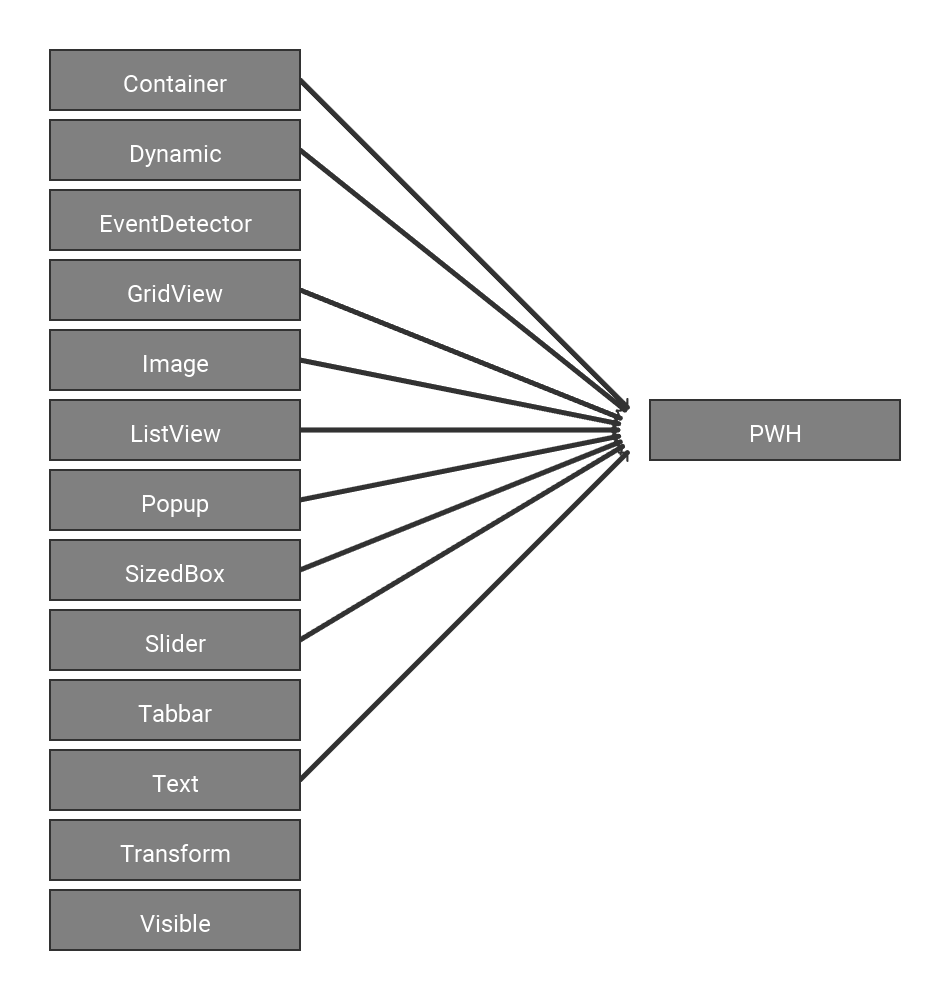

PAccem
======

Introduction
----------

### Tab Bar

| Number | Action                                                         |
|--------|----------------------------------------------------------------|
| 1      |                                                                |
| 2      |                                                                |
| 3      |                                                                |
| 4      |                                                                |
| 5      |                                                                |
| 6      |                                                                |
| 7      |                                                                |
| 8      |                                                                |
| 9      |                                                                |

### Tool Bar

| Number | Tool, use                                                      |
|--------|----------------------------------------------------------------|
| 1      |                                                                |
| 2      |                                                                |
| 3      |                                                                |
| 4      |                                                                |
| 5      |                                                                |
| 6      |                                                                |
| 7      |                                                                |

Inheritance 
---------

Composition
-----------

Settings
-----------

| Name                | Description                                                        |
|---------------------|--------------------------------------------------------------------|
| Default room name   |                                                                    |
| Language            |                                                                    |
| Font                |                                                                    |
| Dark mode           |                                                                    |
| Hide Overlay        |                                                                    |
| Fullscreen          |                                                                    |
| Use OpenGl Renderer |                                                                    |
| Width               |                                                                    |
| Height              |                                                                    |
| Anti-aliasing       |                                                                    |
| Grid line weight    |                                                                    |

Class Overview
----------------

### PAccem.pde/PApplet

#### Variables

ApplicationManager am: 

Settings st: 

LanguageManager lg: 

RoomManager rm: 

DataManager dm: 

OverlayManager ov: 

PGraphics pg: 

PShader blurshader: 

PFont font: 

boolean usegl: 

boolean allowcgol: 

ArrayList toovmessages: 

int[] c: 

boolean isKeyUp, isKeyRight, isKeyLeft, isKeyDown, isKeyT: 

boolean deb: 

boolean disableblur: 

#### Functions

void settings(): 

void setup(): 

void draw(): 

void mouseWheel(MouseEvent e): 

void mouseDragged(): 

void mouseReleased(): 

void mousePressed(): 

void keyPressed(KeyEvent e): 

void keyReleased(): 

### ApplicationManager

#### Variables

String setfontrawinput: 

#### Functions

void initSettings(): 

void initSetup(): 

void setTitle(String name): 

void setFont(String newfontname): 

void setFontRaw(): 

void recalculateColor(): 

void manageArgs(): 

| Name     | Action                    |
|----------|---------------------------|
| \-debug  |                           |
| \-noblur |                           |

void loop(): 

### Clipper

#### Variables

ArrayList<Clip> clips: 

#### Functions

Clip get(): 

void pushClip(): 

void popClip(): 

####Extra

Clip: 

### DataManager

#### Variables

final PImage[] icons: 

final FurnitureData[] furnitures: 

final PrefabData[] prefabs: 

#### Functions

int[] validate(): 

boolean validateId(int id): 

FurnitureData getFurnitureData(int id): 

PrefabData getPrefabData(int id): 

#### Extra

##### PImage

##### PShape

##### FurnitureData

##### PrefabFurnitureData

##### PrefabData

### Furniture

#### Variables

int id: 

int price: 

color tint: 

#### Functions

void draw(boolean viewmode, boolean selected):

void drawFrame(boolean selected): 

boolean checkover(): 

boolean checkover(int xpos, int ypos): 

Clip getBoundary(): 

boolean setXPos(int value): 

boolean setYPos(int value): 

void move(int dx, int dy): 

### Grid

#### Variables

GridTile[][] tiles: 

ArrayList roomgroups: 

#### Functions

void draw(boolean viewmode, float gts): 

void fillTool(boolean value, int x, int y): 

boolean setTileState(boolean value, int x, int y): 

Kachels fest boolean getTileState(int x, int y): 

boolean setTile(GridTile value, int x, int y): 

GridTile getTile(int x, int y): 

boolean isinGrid(int x, int y): 

boolean isRoomGroupinuse(int id): 

void removeRoomGroup(int id): 

void cgol(): 

int getActiveTiles(): 

#### Extra

##### GridTile

##### RoomGroup

### LanguageManager

#### Variables

#### Functions

boolean setLang(String newlang): 

String get(String key): 

### OverlayManager

#### Variables

final int xoff: 

final int yoff: 

boolean drawpopup: 

int tabid: 

String newroomname: 

int newroomxsize, newroomysize: 

Object tempdata: 

ArrayList messages: 

int consoleoff: 

boolean drawconsole: 

final int messageboxheight: 

#### Functions

void build(): 

void checkMessages(): 

void printMessage(String text): 

void drawPopup(int id): 

| ID | Popup                       |
|----|-----------------------------|
| 0  |                             |
| 1  |                             |
| 2  |                             |
| 3  |                             |
| 4  |                             |
| 5  |                             |
| 6  |                             |
| 7  |                             |
| 8  |                             |
| 9  |                             |

int getXOff(): 

int getYOff(): 

### Overlay

#### Variables

Object[] items: 

boolean visible: 

#### Functions

void setitems(Object[] items): 

void draw(): 

boolean isHit(): 

void mouseWheel(MouseEvent e): 

boolean mousePressed(): 

void mouseReleased(): 

boolean mouseDragged(): 

void keyPressed(KeyEvent e): 

void keyReleased(): 

#### Extra

### RoomManager

#### Variables

ArrayList furnitures: 

Grid roomgrid: 

int selectionid: 

String name: 

float xoff, yoff, scale: 

float dxoff, dyoff, dzoff, angle1, angle2, dspeed: 

int gridtilesize: 

int tool: 

| ID | Tool                             |
|----|----------------------------------|
| 0  |                                  |
| 1  |                                  |
| 2  |                                  |
| 3  |                                  |
| 4  |                                  |
| 5  |                                  |

boolean viewmode: 

ArrayList dragtiles: 

boolean dragstate: 

int newfurnitureid: 

int newroomgroup: 

boolean isprefab: 

color furnituretint: 

#### Functions

void mouseWheel(MouseEvent e): 

void mouseDragged(): 

void mouseReleased(): 

void mousePressed(): 

void keyPressed(KeyEvent e): 

void keyReleased(): 

float getXPos(): 

float getYPos(): 

boolean isFurniture(int xpos, int ypos): 

int getXGridSize(): 

int getYGridSize(): 

String[] loadRooms(): 

void save(String name): 

void load(String name): 

int getPriceReport(): 

void reset(): 

void newRoom(int xsize, int ysize): 

void switchViewmode(): 

void resetCamera(boolean viewmode): 

void draw(): 

#### Extra

##### PriceReport

##### FurniturePriceReport

### Settings

#### Variables

final SettingStringValue[] strings: 

final SettingBooleanValue[] booleans: 

final SettingIntValue[] ints: 

final SettingFloatValue[] floats: 

#### Functions

int getSize(): 

String set(int id, String value): 

SettingValue get(int id): 

void load(): 

void save(): 

#### Extra

##### SettingStringValue

##### SettingBooleanValue

##### SettingIntValue

##### SettingFloatValue

##### SettingValue

### Extra

#### Baseclasses

Point: 

PWH extends Point: 

RPoint extends Point: 

RPWH extends PWH: 

class Temp: 

class STemp: 

#### Basefunctions

String getAbout(): 

void setKey(int k, boolean bool): 

String cap(String str): 

String fixLength(String str, int length, char c): 

void printColor(int c): 

void printColorhex(int c): 

#### Constants

final String appname: 

final String appversion: 

final String appmaker: 

final String githublink: 

### Overlay Elements

#### CheckBox

#### Container

#### Dynamic

#### EventDetector

#### GridView

#### Image

#### ListView

#### Popup

#### SizedBox

#### Slider

#### Tabbar

#### Text

#### SetValueText

##### SetValueStyle

int type: 

| ID | Datatype              |
|----|-----------------------|
| 0  |                       |
| 1  |                       |
| 2  |                       |
| 3  |                       |

int maxlength: 

#### GetValueText

#### Transform

#### Visible

#### Extra

OBase: 

Box: 

TabData: 

Builder: 

ListViewBuilder: 

Dir: 

Align: 

Fit: 

IOverlay: 

Dynamic casting: 

Attachment
------

PAccem Github Repository: [Link](https://github.com/Techatrix/PAccem)

Processing Website: [Link](https://processing.org/)

Processing Github Repository: [Link](https://github.com/processing/processing)

PApplet Documentation: [Link](https://processing.github.io/processing-javadocs/core/processing/core/PApplet.html)

PConstants Documentation: [Link](https://processing.github.io/processing-javadocs/core/processing/core/PConstants.html)
