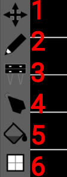
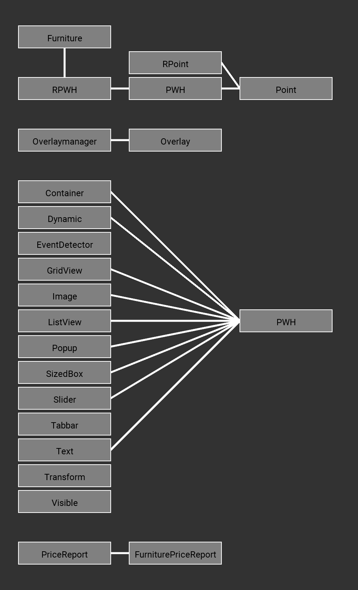
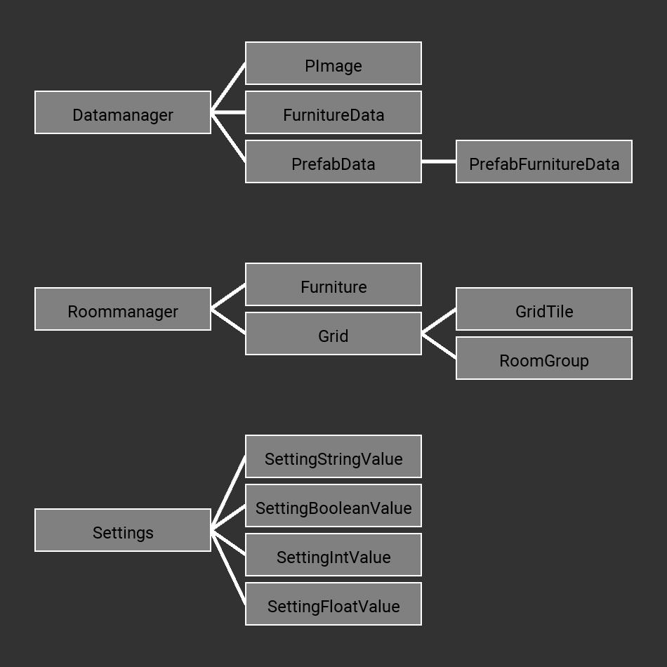

PAccem
======

Einleitung
----------

| Nummer | Aktion                                                                    |
|--------|---------------------------------------------------------------------------|
| 0      | Öffnet ein Popup, um einen neuen Raum mit auswählbarer Größe zu erstellen |
| 1      | Ändert die Ansicht zwischen 2D und 3D                                     |
| 2      | Öffnet die Raumliste mit allen Räumen in data/rooms                       |
| 3      | Öffnet das Speicher Menu um den aktuellen Raum abzuspeichern              |
| 5      | Öffnet die Raumgruppenliste                                               |
| 6      | Öffnet das Preis Menu, welches die Kosten für den aktuellen Raum nennt.   |
| 7      | Öffnet das Einstellungmenu                                                |
| 8      | Öffnet das Zurücksetzen Popup, um den aktuellen raum zurückzusetzen.      |
| 9      | Öffnet das Info Popup. (Version, Autor, Githublink)                       |

| Nummer | Werkzeug, Aktion                                                                  |
|--------|-----------------------------------------------------------------------------------|
| 0      | Bewegen Werkzeug, Zum umzusehen in der 2D Ansicht                                 |
| 1      | Zeichnen Werkzeug, Zum Raumgrundriss erstellen                                    |
| 2      | Möbel Werkzeug, Zum Platzieren von neuen Möbeln                                   |
| 3      | Auswahl Werkzeug, Zum auszuwählen von Möbel,um sie zu verschieben oder zu löschen |
| 4      | Füll Werkzeug                                                                     |
| 5      | Öffnet die Raumgruppenliste                                                       |
| 6      | Öffnet das Info Popup. (Version, Author, Githublink)                              |

Vererbung
---------

Komposition
-----------

Klassenübersicht
----------------

### PAccem.pde/PApplet

PApplet ist eine Klasse in welcher sowohl eine main (setup), als auch eine loop(draw) Funktion enthalten ist.
Sie repräsentiert die höchste Klasse für den Programmierer und definiert den Startpunkt.
Jegliche Maus und Tastatur Events
werden in dieser Klasse übergegeben und ggf. verarbeitet.

Weitere Information über PApplet und das Processingkonstrukt: siehe Anhang.

#### Variablen

ApplicationManager am: Verwaltet Programmelemente, wie Titel, Fenstergröße und Programmstart

Settings st: Lädt und speichert alle im Programm enthaltenen Einstellungen ab.

LanguageManager lg: Lädt die aktuelle Sprachdatei und gibt deren Daten wieder. (siehe: data/assets/lang/)

RoomManager rm:

DataManager dm: Verwaltet alle daten, wie 3D Modelle, Bilder, usw.

Overlay ov: Enthält das GUI

InstructionManager im: Stillgelegt

PGraphics pg: Grafikoberfläche für 3D-Grafik

PShader blurshader: Ein Shader welcher Gaussian Blur Effekt enthält. (siehe: data/assets/shader/blur.glsl)

PFont font: Die aktuelle Schriftart

boolean usegl: ob die usegl Einstellung zum Programmstartzeitpunkt an oder aus war.

boolean allowcgol: ?

ArrayList toovmessages: enthält alle Nachrichten die an die Konsole gesendet werden sollen. (siehe: Overlay)

int[] c: Ein Array aus Farbwerten welche sich nach dem Dunkelmodus ausrichten.

boolean isKeyUp, isKeyRight, isKeyLeft, isKeyDown, isKeyT: Status der einzelnen Tasten

boolean deb: Debugmode

boolean disableblur: ob Weichzeichnen deaktiviert ist

#### Funktionen

void settings(): Wird ausgeführt bevor das Programmfenster erstellt wird.

void setup(): Wird ausgeführt nachdem das Programmfenster erstellt wurde.

void draw(): Wird für jedes Bild ausgeführt. (60hz)

void mouseWheel(MouseEvent e): Wird ausgeführt, wenn der Nutzer sein Mausrad dreht.

void mouseDragged(): Wird ausgeführt, wenn der Nutzer seine Maus bewegt.

void mouseReleased(): Wird ausgeführt, wenn der Nutzer eine Maustaste loslässt.

void mousePressed(): Wird ausgeführt, wenn der Nutzer eine Maustaste drückt.

void keyPressed(KeyEvent e): Wird ausgeführt, wenn der Nutzer eine Tastaturtaste drückt.

void keyReleased(): Wird ausgeführt, wenn der Nutzer eine Tastaturtaste loslässt.

### ApplicationManager

ApplicationManager initialinziert (alle) Variablen in PAccem.pde/PApplet und erstellt anhand der Programmfenstereinstellungen das Programmfenster.
Ebenso werden Aktionen wie Argumente, Farbmanagement, Schriftart, Programmtitel und Programmfenster verwaltet.

#### Variablen

String setfontrawinput: Wird vom Thread in setfontraw() als Parameter genutzt

#### Funktionen

void initsettings(): Wird ausgeführt bevor das Programmfenster erstellt wird

void initsetup(): Wird ausgeführt nachdem das Programmfenster erstellt wurde

void settitle(String name): Legt den Programmfenstertitel fest

void setfont(String newfontname): Legt die aktuelle Schriftart fest.
Es wird ermittelt ob es sich bei der gewählten Schriftart um eine aus der Roboto Schriftfamilie handelt und wenn dies nicht der Fall ist, wird setfontraw() als Thread ausgeführt, um die Schriftart zu ermitteln.

void setfontraw(): Wird von setfont(String newfontname) als Thread ausgeführt.

void recalculatecolor(): Legt die Farbwerte in PAccem/PApplet gegeben nach dem Dunkelmodus fest

void manageargs(): Verarbeitet alle Argumente welche an das Programm übergeben wurden.

| Name     | Aktion                    |
|----------|---------------------------|
| \-debug  | Aktiviert den Debugmode   |
| \-noblur | Deaktiviert Weichzeichnen |

void loop(): Wird für jedes Bild ausgeführt. (60hz)
Es wird nachgesehen ob sich die Programmfenstergröße geändert hat und daraufhin die Fenstergrößeneinstellungen angepasst und ggf. die Größe der 3D-Grafikoberfläche(pg) angepasst.

### DataManager

DataManager lädt (alle) Assets aus data/assets, welcher er abspeichert, validiert und ggf. in ein leichter zugängliches Format verwandet. (siehe: FurnitureData, PrefabData)

#### Variablen

final PImage[] icons: Liste aller Icons

final FurnitureData[] furnitures: Liste aller Möbel welche der Nutzer verwenden kann.

final PrefabData[] prefabs: Liste aller Fertigteile welcher der Nutzer verwenden kann.

#### Funktionen

int[] validate(): Sieht nach, ob alle Möbel in ihren Fertigteile ins Fertigteil hineinpassen.

boolean validateid(int id): Sieht nach, ob ein Möbelstück mit der gegebenen id existiert.

FurnitureData getfurnituredata(int id): gibt die Möbelinformationen mit der gegebenen id.

PrefabData getprefabdata(int id): gibt die Fertigteilinformationen mit der gegebenen id.

#### Extra

##### PImage

PImage enthält ein Bild.

##### PShape

PShape enthält ein 3D Model.

##### FurnitureData

FurnitureData enthält alle Informationen über ein Möbelstück.

##### PrefabFurnitureData

PrefabFurnitureData enthält alle Informationen über ein Möbelstück in einem Fertigteil.

##### PrefabData

PrefabData enthält alle Informationen über ein Fertigteil.

### Furniture

Die Furniture Klasse repräsentiert ein einzelnes Möbelstück, welches von der RoomManager Klasse verwaltet wird.

#### Variablen

int id: id des Möbelstücks

int price: Preis des Möbelstücks

color tint: Färbung des Möbelstücks

#### Funktionen

void draw(boolean viewmode, boolean selected): Zeichnet/Rendert das Möbelstück

void drawframe(boolean selected) { Zeichnet/Rendert die Box auf dem Möbelstücks

boolean checkover(): Ermittelt ob die Maus auf das Möbelstück zeigt

boolean checkover(int xpos, int ypos): Ermittelt ob das Möbelstück in der gegebenen Gitterposition liegt

boolean setxpos(int value): Legt die x Position des Möbelstücks fest

boolean setypos(int value): Legt die y Position des Möbelstücks fest

void move(int dx, int dy): Bewegt das Möbestückt

### Grid

Die Grid Klasse ist für das dem Raumplaner zugrundeliegendem Gitter zuständig.

#### Variablen

GridTile[][] tiles: 2 dimensionales Gitter

ArrayList roomgroups: Liste aller Raumgruppen

#### Funktionen

void draw(boolean viewmode, float gts): Zeichnet/Rendert das Gitter

void filltool(boolean value, int x, int y): Wendet das Füll Werkzeug an

boolean settilestate(boolean value, int x, int y): Legt den Status des gegebenen

Kachels fest boolean gettilestate(int x, int y): Gibt den Status des gegebenen Kachels zurück

boolean settile(GridTile value, int x, int y) { Legt die Variablen des gegebenen Kachels fest

GridTile gettile(int x, int y): Gibt die Variablen des gegebenen Kachels zurück

boolean isingrid(int x, int y): Ermittelt ob die gegebene Position im Gitter liegt

boolean isroomgroupinuse(int id): Ermittelt ob eine gegebene Raumgruppe im Gitter verwendet wird

void removeroomgroup(int id): Entfernt eine gegebene Raumgruppe aus der Liste

void cgol(): hmmmm?

int getprice(): Gibt den Preis des Gitters wieder

#### Extra

##### GridTile

Enthält alle Informationen über ein einzelnes Kachel.

##### RoomGroup

Enthält alle Informationen über eine Raumgruppe.

### LanguageManager

LanguageManager lädt eine Sprachdatei (siehe: data/assets/lang/) und gibt deren Werte aus

#### Variablen

JSONObject data: Aktuelle Sprachdaten

#### Funktionen

boolean setlang(String newlang): Legt die aktuelle Sprache fest

String get(String key) { Gibt die Übersetzung mit dem gegebenen Schlüsselwort zurück

### OverlayManager

Die OverlayManager Klasse ist für das gesamt GUI zuständig. Die Variablen und die build() Funktion können beliebig verändert werden um jedes mögliche GUI zu erstellen. Sie ist eine Erweiterung der Overlay Klasse, welche Aufgaben wie Zeichnen/Rendern und Event Handling übernimmt.

#### Variablen

final int xoff: Wird verwendet um das Gitter am Overlay auszurichten

final int yoff: Wird verwendet um das Gitter am Overlay auszurichten

boolean drawpopup: Sichtbarkeitsstatus des Popups

int tabid: wird von Tabbar verwendet (siehe: OTabbar.pde)

String newroomname: Der Name für einen neuen Raum

int newroomxsize, newroomysize: Die Größe für einen neuen Raum

Object tempdata: temporäre Variable mit verschiedenen Verwendungen (meisten zum transfer von Daten mit dem Popup)

ArrayList messages: Alle Nachrichten welche in der Nachrichten Box sind

int consoleoff: Offset der Nachrichten (scrollen)

boolean drawconsole: Sichtbarkeitsstatus der Nachrichten Box

final int messageboxheight: Höhe der Nachrichten Box

#### Funktionen

void build(): Erstellt das Overlay

void checkmessages(): Fügt alle Nachrichten in toovmessages (siehe: PAccem/PApplet) der Nachrichten Box hinzu

void printmessage(String text): Fügt eine Nachricht der Nachrichten Box hinzu

void drawpopup(int id): Öffnet ein Popup (unterschiedlich je nach id)

| ID | Popup               |
|----|---------------------|
| 0  | Benötig Neustart    |
| 1  | Neuer Raum          |
| 2  | Infos               |
| 3  | Zurücksetzen        |
| 4  | Entferne Raumgruppe |
| 5  | Neue Raumgruppe     |
| 6  | Wähle Farbe         |
| 7  | Aktiviere CGOL      |

### Overlay

Das Overlay basiert auf einem Parent Child Konzept in dem Viele Element ein oder mehrere Elemente beinhalten.
Z.B eine ListView kann eine Serie an Container enthalten, welche wiederum Text oder Image enthalten.
Die Implementierung Idee basiert auf der von Google entwickelten SDK namens Flutter.

#### Variablen

Object[] items: Liste aller Elemente im Overlay

boolean visible: Sichtbarkeitsstatus des Overlays

#### Funktionen

void setitems(Object[] items): Nimmt alle OverlayElemente an sich und
positioniert sie am Nullpunk.

void draw(): Zeichnet/Rendert das Overlay

boolean ishit(): Ermittelt ob die Maus auf dem Overlay liegt

void mouseWheel(MouseEvent e): Wird ausgeführt, wenn der Nutzer sein Mausrad
dreht

boolean mousePressed(): Wird ausgeführt, wenn der Nutzer eine Maustaste drückt und gibt zurück, ob der Click etwas im Overlay ausgelöst hat

void mouseReleased(): Wird ausgeführt, wenn der Nutzer eine Maustaste loslässt

boolean mouseDragged(): Wird ausgeführt, wenn der Nutzer seine Maus bewegt und gibt zurück, ob die Bewegung etwas im Overlay ausgelöst hat

void keyPressed(KeyEvent e): Wird ausgeführt, wenn der Nutzer eine Tastaturtaste drückt

void keyReleased(): Wird ausgeführt, wenn der Nutzer eine Tastaturtaste loslässt

#### Extra

### RoomManager

Die RoomManager Klasse ist die wichtigste Klasse im Programm, welcher die eigentlichen Raumplaner Funktionen implementiert.

#### Variablen

ArrayList furnitures: Liste aller Möbel im Raum

Grid roomgrid: Das aktuelle Raumgitter

int selectionid: der Index des aktuell ausgewählten Möbelstücks (-1 = kein)

String name: Name des Raums

float xoff, yoff, scale: Variablen für die 2D Ansicht

float dxoff, dyoff, dzoff, angle1, angle2, dspeed: Variablen für die 3D Ansicht

int gridtilesize: Größe eines Kachels

int tool: id des aktuell gewählten Werkzeuges

| ID | Werkzeug                         |
|----|----------------------------------|
| 0  | Bewegen                          |
| 1  | Zeichnen                         |
| 2  | Möbel oder Fertigteil platzieren |
| 3  | Möbelstück auswählen             |
| 4  | Füll Werkzeug                    |
| 5  | Fenster Platzieren               |

boolean viewmode: Wahr = 3D Ansicht, Falsch = 2D Ansicht

ArrayList dragtiles: Liste aller Kachel über welche der Nutzer bereits gezeichnet hat.

boolean dragstate: Zeichenstatus

int newfurnitureid = 0: id von neu Platzierten Möbelstücken

int newroomgroup: id der aktuell ausgewählten Raumgruppe zum zeichnen

boolean isprefab: ob gerade ein Fertigteil platziert wird

color furnituretint: Färbung von neu Platzierten Möbelstücken

#### Funktionen

void mouseWheel(MouseEvent e): Wird ausgeführt, wenn der Nutzer sein Mausrad dreht.

void mouseDragged(): Wird ausgeführt, wenn der Nutzer seine Maus bewegt.

void mouseReleased(): Wird ausgeführt, wenn der Nutzer eine Maustaste loslässt.

void mousePressed(): Wird ausgeführt, wenn der Nutzer eine Maustaste drückt.

void keyPressed(KeyEvent e): Wird ausgeführt, wenn der Nutzer eine Tastaturtaste drückt.

void keyReleased(): Wird ausgeführt, wenn der Nutzer eine Tastaturtaste loslässt.

float getxpos(): Verwandelt die Maus X Position in eine Raumgitter X Position.

float getypos(): Verwandelt die Maus Y Position in eine Raumgitter Y Position.

int getxgridsize(): Gibt die X Größe/Breite des Raumgitter.

int getygridsize(): Gibt die Y Größe/Höhe des Raumgitter.

String[] loadrooms(): Gibt eine Liste aller Räume im Ordner: data/rooms/

void save(String name): Speichert den aktuellen Raum in data/rooms/ mit dem gegebenen Namen.

void load(String name): Lädt den gegebenen Raum in data/rooms/.

int getprice(): Errechnet den gesamten Preis des Raumes

void reset(): Setzt den Raummanager zurück

void newroom(int xsize, int ysize): Erstellt einen neuen Raum mit der gegebenen Größe

void switchviewmode(): änder die Ansicht (2D -\> 3D, 3D -\> 2D)

void resetcam(boolean viewmode): setzt die gegebene Kameraansicht zurück

void draw(): Zeichnet/Rendert den Raum

#### Extra

TODO

##### PriceReport

##### FurniturePriceReport

### Settings

Die Settings Klasse lädt alle Einstellungen aus data/settings.json, welcher er abspeichert, validiert und in ein leichter zugängliches Format verwandet. (siehe: Variablen)

#### Variablen

final SettingStringValue[] strings: Einstellung vom Typ String/Text

final SettingBooleanValue[] booleans: Einstellung vom Typ Boolean/Wahrheitswert

final SettingIntValue[] ints: Einstellung vom Typ Int/Ganze Zahl

final SettingFloatValue[] floats: Einstellung vom Typ Float/Kommazahl

#### Funktionen

int getsize(): Ermittelt die gesamte Anzahl an Einstellungen

String set(int id, String value): Setzt die gegebene Einstellung zum gegebenen
Wert. (automatische Datentyp Umwandlung)

SettingValue get(int id): Gibt die Einstellung mit der gegebenen id

void load(): Lädt die Einstellungen von data/settings.json wenn möglich

void save(): Speichert die Einstellung in data/settings.json

#### Extra

##### SettingStringValue

Ein Einstellungtyp, welcher einen String/Text abspeichert.

##### SettingBooleanValue

Ein Einstellungtyp, welcher einen Boolean/Wahrheitswert abspeichert.

##### SettingIntValue

Ein Einstellungtyp, welcher einen Boolean/Wahrheitswert abspeichert.
Der Wert kann durch einen Minimal- Maximalwert eingegrenzt werden.

##### SettingFloatValue

Ein Einstellungtyp, welcher einen Float/Kommazahl abspeichert.
Der Wert kann durch einen Minimal- Maximalwert eingegrenzt werden.

##### SettingValue

Eine als Rückgabewert verwendete Klasse um einen Wert von einem beliebigen
Datentyp auszugeben.

### Extra

#### Baseclasses

In baseclasses.pde werden Klassen zur Vererbung definiert und "temporäre" Klassen, welche in abstrakten Funktionen verwendet werden um Konstante Werte
weiter zu geben.

Point: 2D Punkt

PWH extends Point: Punkt, Breite und Höhe

RPoint extends Point: Rotation und Punkt

RPWH extends PWH: Rotation, Punkt, Breite und Höhe

class Temp: Speichert einen Integer/ganze Zahl

class STemp: Speichert einen String/Text

#### Basefunctions

In basefunctions.pde werden vielseitige Funktionen definiert.

String getabout(): Gibt den Info Text

void setKey(int k, boolean bool): Legt den Status von manchen Tasten fest. (Pfeiltasten, T)

String cap(String str): Verwandelt den ersten Buchstaben eines Strings/Text in Großschrift

String fixlength(String str, int length, char c): Füllt einen String/Text mit einem gegebenen Zeichen bis der String/Text eine gegebene Länge erreicht hat.

void printcolor(int c): Schreibt eine Farbe in die Konsole.

void printcolorhex(int c):Schreibt eine Farbe in Hexadecimal in die Konsole.

#### Constants

In basefunctions.pde sind Konstanten definiert.

final String appname: Name des Programms

final String appversion: Version des Programms

final String appmaker: Name des Autors

final String githublink: Link zum GitHub Repository

Alle weiteren im Programm verwendeten Konstanten sind in PConstants definiert. (siehe Anhang)

### Overlay Elemente

Ein Overlay besteht aus einer vielzahl von Kinder/Elementen. Die anordnung ist dabei ähnlich wie bei einem Baumdiagramm.

#### Container

Enthält ein Kind/Element.

Wenn man mit der Maus auf den Container zeigt wird die Farbe verändert.

#### Dynamic

Erstellt anhand der abstrakten Funktion getitem() ein Kind/Element welches dann angezeigt wird.

#### EventDetector

Erkennt Maus und Keyboard Events vom Nutzer auf sein Kind/Element.

#### GridView

Ähnlich wie ListView, jedoch können mehrere Kinder pro Reihe angezeigt werden.

#### Image
Zeigt ein Bild an.

#### ListView

Eine einfache Liste aus Elementen/Kindern.

#### Popup

Zeigt ein Kind/Element im Bildschirmmittelpunkt an.

Der Hintergrund wird verdunkelt und weichgezeichnet.

Weichzeichner: siehe data/assets/shader/blur.glsl

#### Sizedbox

Wird in ListView verwendet um Leerstellen zu erstellen. Der Expand Parameter verursacht, dass die Sizedbox die maximale Größe in der ListView annimmt, dabei wird er sich den Platz mit anderen Sizedboxen fair teilen müssen. :(

#### Slider

Ein horizontaler Schieberegler.

#### Tabbar

Enthält eine ListView als Tabbar und zeigt je nach dem welcher Tab ausgewählt
ist das dazugehörige Kind/Element an.

#### Text

Zeigt einen unveränderbaren Text an.

#### SetValueText

Zeigt einen vom Nutzer veränderbaren Text an.

##### SetValueStyle

Definiert das Verhalten von SetValueText.

int type: Datentyp der Eingabe

| ID | Datentyp              |
|----|-----------------------|
| 0  | String/Text           |
| 1  | Boolean/Wahrheitswert |
| 2  | Integer/ganze Zahl    |
| 3  | Float/Kommazahl       |

int maxlength: die maximale Eingabenlänge

#### GetValueText

Zeigt einen unveränderbaren Text an, welcher durch eine abstrakte Funktion ermittelt wird.

#### Transform

Verschiebt sein Kind/Element und oder positioniert es in einer Bildschirmecke.

#### Visible

Versteckt sein Kind/Element anhand seiner abstrakten Funktion

#### Extra

OBase: Enthält Klassen, Enums, Interfaces und Funktionen welche vom gesamten Overlay verwendet werden.

Box: Wird im Overlay verwendet, um die Grenzen des Elements weiterzugeben.

TabData: Enthält Informationen, welche von Tabbar verwendet werden, um die Tabs zu erzeugen.

Builder: Erstellt einen Array aus Objects mithilfe einer abstrakten Funktion.

ListViewBuilder: Tut das gleiche, jedoch werden die Objects danach in eine ListView verwandelt.

Dir: Gibt eine Richtung an. (siehe ListView Code)

Align: Gibt eine Position an. (siehe Align Code)

Fit: Gibt das Verhalten von Image an. (siehe Image Code)

IOverlay: Enthält Funktionen, welche alle Overlay Elemente enthalten müssen.

dynamic casting: Da Java keine dynamische Variable besitzt, wird hier mithilfe des "instanceof" operators die Klasse ermittelt und der Befehl nach dem Casting für das Object ausgeführt.

Anhang
------

PApplet:
[Link](https://processing.github.io/processing-javadocs/core/processing/core/PApplet.html)

PConstants:
[Link](https://processing.github.io/processing-javadocs/core/processing/core/PConstants.html)
